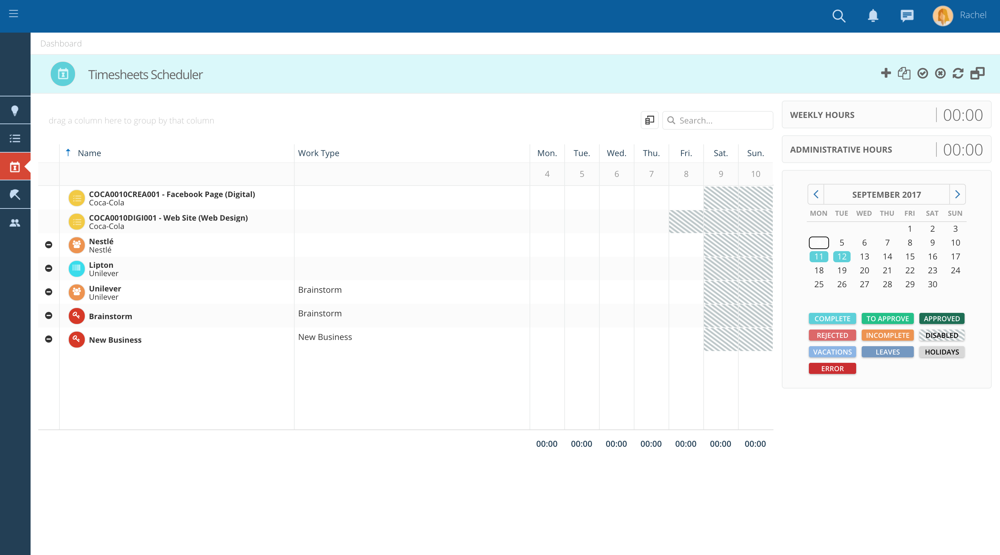
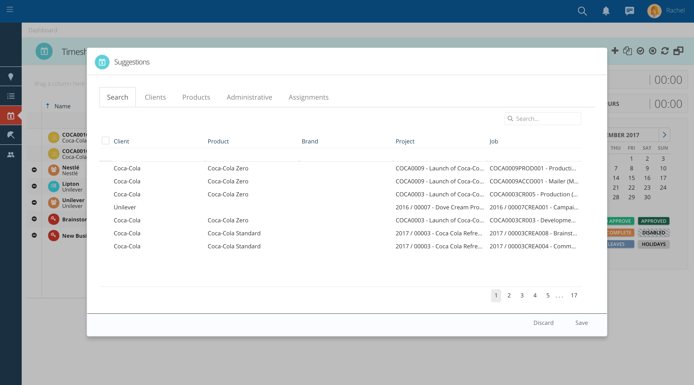
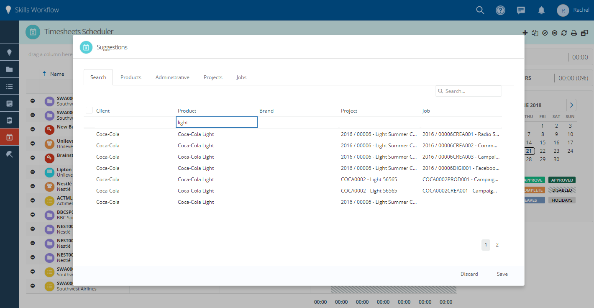
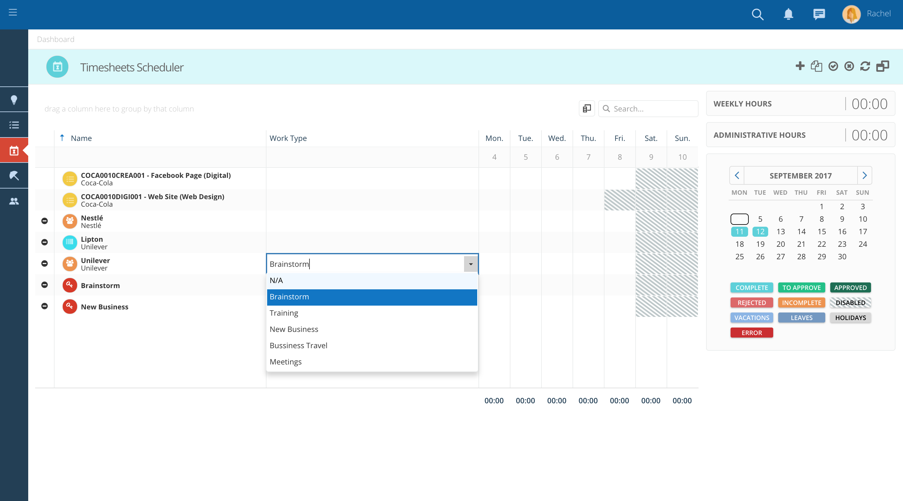
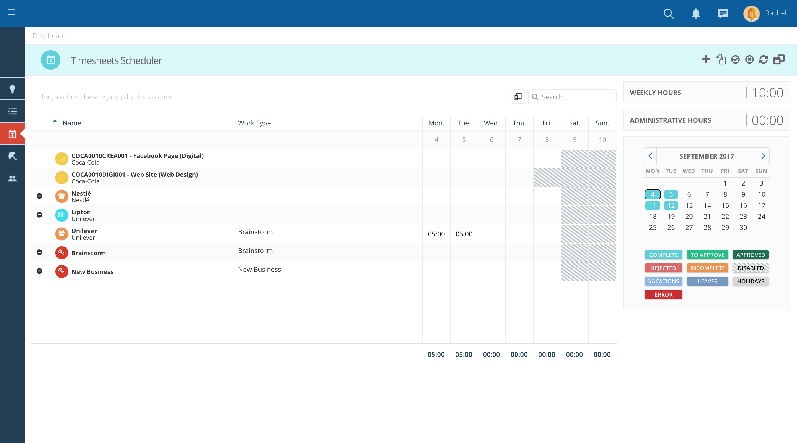
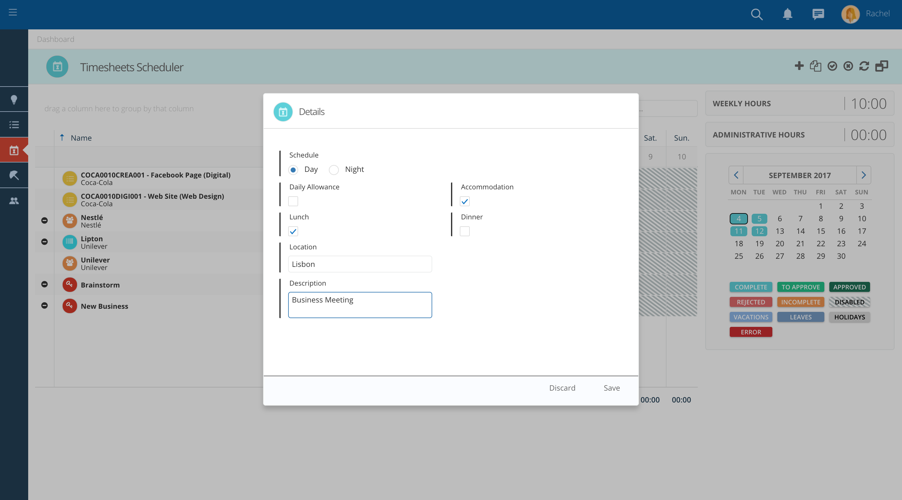
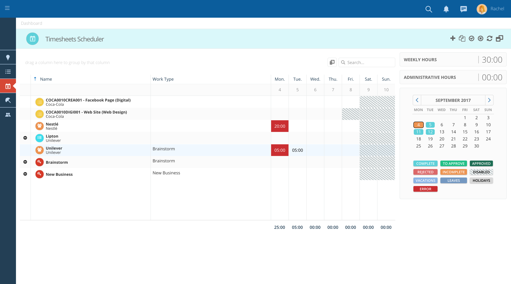
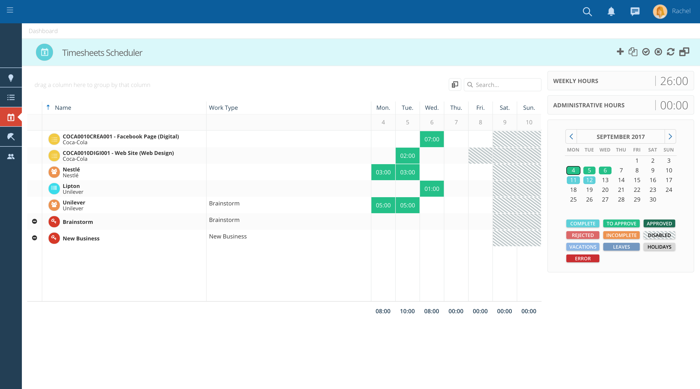
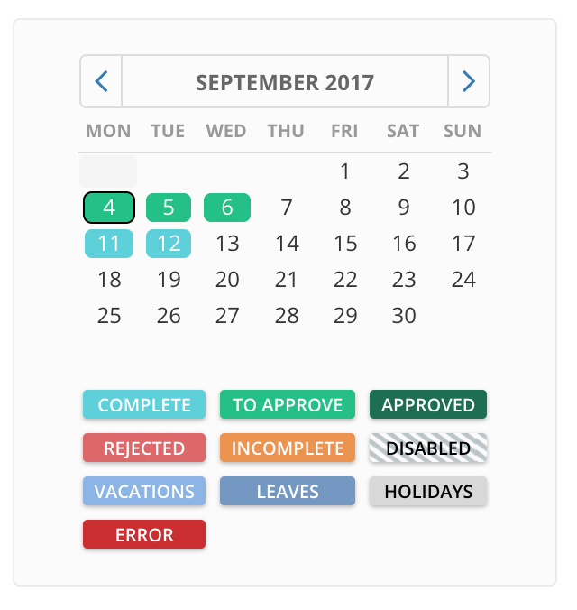

## Lição 1 - Preencher Folhas de horas

:::note 
Para preencher horas, navegue para o módulo **Time sheets**
:::

1. Para preencher horas, navegue para o módulo "Timesheets"

<figure>

<figcaption>Módulo de Folha de Horas</figcaption>
</figure>

2. Verifique se algumas linhas aparecem em sua grade automaticamente, com base nos trabalhos aos quais você foi atribuído.

3. Se você não estiver vendo o trabalho ou projeto de que precisa, clique em "+" para adicionar uma nova entrada à grade do quadro de horários. Um pop-up será aberto.

4. Em seguida, use o campo de pesquisa na parte superior para pesquisar rapidamente o número do trabalho, o nome do cliente ou qualquer outra palavra-chave.

5. Neste popup você pode encontrar diferentes abas, dependendo de seus acessos.

6. Cada guia possui um ícone "Pesquisar", onde você pode filtrar facilmente as informações.

7. Você também pode filtrar ainda mais um campo específico digitando o que está procurando em cada título de coluna.

<figure>

<figcaption>Pop-up Folha de Horas</figcaption>
</figure>

<figure>

<figcaption>Filtrar por um filtro específico</figcaption>
</figure>

8. É possível especificar o tipo de atividade que você tem feito (por exemplo, pesquisa, reunião, etc.) para cada entrada de tempo. Vá para a coluna do tipo de trabalho e selecione o tipo de trabalho para cada linha na lista suspensa.

<figure>

<figcaption>Insira um tipo de trabalho</figcaption>
</figure>

  
9. Verifique se os indicadores, no lado direito da folha de horas, mudam conforme insere o tempo.

<figure>

<figcaption>Clique em cada célula e apresente as horas que você trabalhou</figcaption>
</figure>

10. Verifique se você pode adicionar mais detalhes às suas entradas clicando com o botão direito do mouse e pressionando "detalhes".

<figure>

<figcaption>Adicione detalhes a cada célula.</figcaption>
</figure>

11. Verifique se não há células vermelhas (horas inválidas).

12. Eles podem aparecer se você estiver excedendo suas horas diárias máximas ou se tiver inserido o tempo num nível que não tenha permissão para (por exemplo, se inseriu o tempo num projeto e só tiver permissão para inserir o tempo em trabalhos).

13. Se for esse o caso, apague essas horas e insira-as novamente na linha correta.

14. Clique em "+" se a entrada de que precisa ainda não estiver em sua planilha de horas.

15. Você também pode ter permissão ou não para inserir tempo no fim de semana, feriados ou dias de férias, dependendo da política da sua empresa.

<figure>

<figcaption>Horas inválidas e datas bloqueadas</figcaption>
</figure>
    

16. Quando estiver pronto, envie sua planilha de horas para aprovação clicando na seta, na barra de menu da folha de horas.
17. Verifique se a cor das células muda para verde claro. Espere que seu supervisor aprove sua folha de horas.

<figure>

<figcaption>Enviados para aprovação</figcaption>
</figure>
    

18. Verifique a legenda de baixo do calendário para obter detalhes.
19. Verifique se não há dias / semanas incompletos.
20. Verifique se não há dias pendentes de envio para aprovação (dias em azul)

<figure>

<figcaption>Calendário</figcaption>
</figure>

---

## Lição 2 - Aprovar Folhas de Horas

:::note
Navegue para o módulo **Time sheets Approval**
:::

<figure>

<figcaption>Módulo de Folha de Horas</figcaption>
</figure>

1. Pode aprovar todas as folhas de horas solicitadas clicando no ícone de verificação no lado superior direito.

<figure>

<figcaption>Aprovar todas as folhas de horas</figcaption>
</figure>

2. Aprove um grupo clicando no ícone de verificação na barra de grupos.

<figure>

<figcaption>Aprovar grupo de folhas de horas</figcaption>
</figure>

3. Aprove apenas o selecionado clicando no ícone de verificação no lado superior direito após selecionar as planilhas de horas pretendidas.

<figure>

<figcaption>As folhas de horas selecionadas aparecem em um azul mais escuro.</figcaption>
</figure>

4. As folhas de horas aprovadas terão um verde mais escuro

<figure>

<figcaption>Folhas de horas aprovadas</figcaption>
</figure>

---

## Lição 3 - Planear e Marcar Ausências

:::note
No mesmo workspace on as **folhas de horas** são aprovadas.
:::

1. Também é possível rejeitar todos clicando no ícone X no lado superior direito ao lado do ícone de verificação.

<figure>

<figcaption>Rejeitar todas as folhas de horas</figcaption>
</figure>

2. Para rejeitar um grupo, basta ter em **Aprovação da Folha de Horas**. Na barra de grupo, clique no ícone X.

<figure>

<figcaption>Rejeitar um grupo de folha de horas</figcaption>
</figure>

3. Apenas clicando no ícone X no lado superior direito próximo ao ícone de verificação depois de selecionar as folhas de horas pretendidas.

<figure>

<figcaption>As folhas de horas selecionadas aparecem em um azul mais escuro.</figcaption>
</figure>

<figure>

<figcaption>As folhas de horas rejeitadas aparecerão em vermelho.</figcaption>
</figure>
